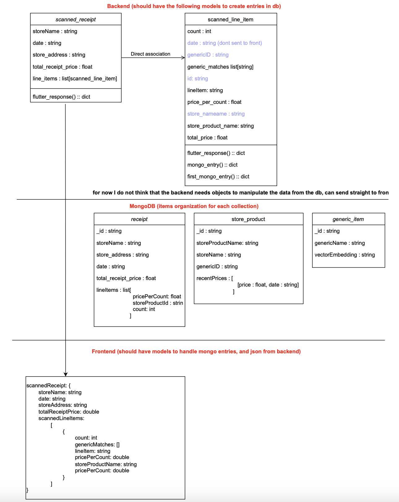

## Getting Started

Run the following commands to set up local development environment

`'pip install -r requirements.txt'`

`python DevSetUp.py`

Add all required connection strings, resource keys, and prompts to the generated .env file.

If importing any new packages when developing, please make sure to update the requirements.txt file - this is crutial for deployment!

## Doccumentation

View Swagger Doccumentation for API during local dev by running app.py and visiting http://127.0.0.1:5000/apidocs/

## Models and JSON standards

## Deployment

Currently deployed code is on prod branch. 

Backend is currently deployed on Azure App Service. When running, the following endpoints can be accessed:

application: https://kubera-avbyczbee5fybnht.eastus2-01.azurewebsites.net/

doccumentation: https://kubera-avbyczbee5fybnht.eastus2-01.azurewebsites.net/apidocs/
